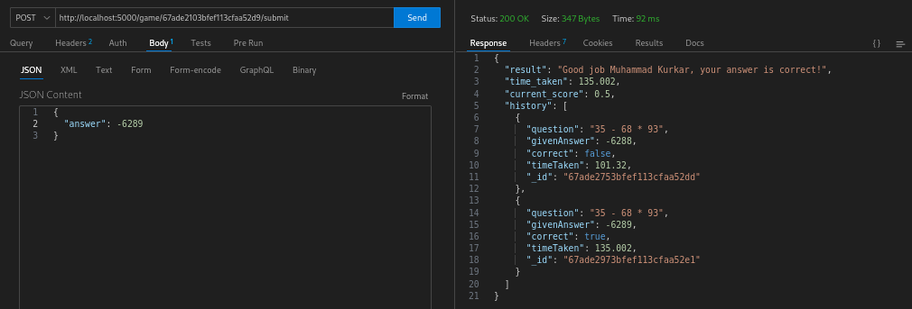

# Dev Mind Speed 

A mathematical challenge game designed to enhance mental calculation speed and accuracy.

## Overview

Dev Mind Speed is an interactive game that challenges developers to solve mathematical equations quickly and accurately. The game adapts its difficulty based on the player's level selection and tracks performance metrics.

## Features

- 4 difficulty levels with increasing complexity
- Real-time scoring system
- Performance tracking and history
- Time-based challenges
- Dynamic equation generation
- RESTful API architecture

## Project Structure

```
circa/
├── src/
│   ├── config/
│   │   └── db.js           # Database configuration
│   ├── controllers/
│   │   └── gameController.js # Game logic handlers
│   ├── models/
│   │   └── Game.js          # Game data model
│   ├── routes/
│   │   └── gameRoutes.js    # API routes
│   ├── utils/
│   │   └── equationGenerator.js # Equation generation logic
│   └── app.js              # Express application setup
├── .env                    # Environment variables
├── server.js              # Server entry point
└── package.json           # Project dependencies
```

## API Endpoints

### 1. Start Game
- **POST** `/game/start`
- **Body**: 
```json
{
    "name": "Player Name",
    "difficulty": 1-4
}
```

### 2. Submit Answer
- **POST** `/game/:game_id/submit`
- **Body**: 
```json
{
    "answer": number
}
```

### 3. Get Game Status
- **GET** `/game/:game_id/status`

## Difficulty Levels

1. **Level 1**: Basic operations with 2 numbers (1-9)
2. **Level 2**: Operations with 2 numbers (1-99)
3. **Level 3**: Complex operations with 3 numbers
4. **Level 4**: Advanced operations with 4 numbers

## Technical Stack

- **Backend**: Node.js + Express
- **Database**: MongoDB
- **ODM**: Mongoose
- **API Testing**: Postman/Insomnia

## Getting Started

1. Clone the repository
```bash
git clone <repository-url>
```

2. Install dependencies
```bash
npm install
```

3. Set up environment variables
```
MONGO_URI=your_mongodb_connection_string
PORT=5000
```

4. Run the server
```bash
npm start
```

## How to Play

### 1. Start a New Game
Send a POST request to start a new game:
```bash
curl -X POST http://localhost:5000/game/start \
-H "Content-Type: application/json" \
-d '{"name": "Player1", "difficulty": 1}'
```


### 2. Submit Your Answer
Use the game_id from the start response to submit your answer:
```bash
curl -X POST http://localhost:5000/game/{game_id}/submit \
-H "Content-Type: application/json" \
-d '{"answer": 42}'
```



### 3. Check Your Progress
View your game statistics:
```bash
curl http://localhost:5000/game/{game_id}/status
```


### Example Game Flow
1. Player starts a new game at difficulty level 1
2. Server generates an equation like "5 + 3"
3. Player submits their answer
4. Server validates and returns the result
5. Process repeats with new equations

## Game Logic

- Each game session generates unique mathematical equations
- Answers are evaluated in real-time
- Score calculation based on:
  - Accuracy of answers
  - Time taken to solve
  - Difficulty level

## License

This project is licensed under the MIT License - see the LICENSE file for details.
